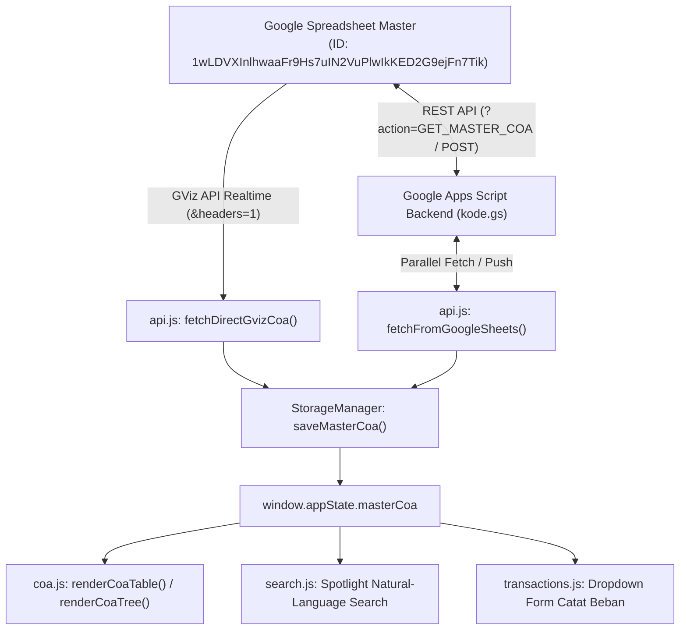

# ExpenseFlow — Astra SO Operating Expenses
> **Enterprise Product Requirements Document (PRD) & Technical Specification**  
> *Sistem Tata Kelola & Pencatatan Beban Operasional Astra Sales Operation (SO 2021) Berbasis Realtime Google Spreadsheet*

---

## 📋 Daftar Isi
1. [Ringkasan Eksekutif & Visi Produk](#1-ringkasan-eksekutif--visi-produk)
2. [Latar Belakang & Masalah Bisnis](#2-latar-belakang--masalah-bisnis)
3. [Persona Pengguna & Alur Kerja](#3-persona-pengguna--alur-kerja)
4. [Kebutuhan Fungsional (Functional Requirements)](#4-kebutuhan-fungsional-functional-requirements)
5. [Arsitektur Teknis & Struktur Proyek](#5-arsitektur-teknis--struktur-proyek)
6. [Skema Data & Taksonomi COA Astra SO](#6-skema-data--taksonomi-coa-astra-so)
7. [Panduan Integrasi Google Spreadsheet & Apps Script](#7-panduan-integrasi-google-spreadsheet--apps-script)
8. [Pintasan Keyboard & Aksesibilitas](#8-pintasan-keyboard--aksesibilitas)

---

## 1. Ringkasan Eksekutif & Visi Produk

**ExpenseFlow** adalah platform web modern untuk standarisasi pencatatan, verifikasi perpajakan, dan pemantauan beban operasional (*Operating Expenses / Opex*) di lingkungan jaringan cabang **Astra Sales Operation (SO 2021)**. 

Platform ini menjembatani operasional kasir cabang dengan standar akuntansi SAP ECC Astra dan kepatuhan audit PSAK, mengeliminasi risiko salah pembebanan akun (*misclassification*), serta menyajikan antarmuka visual berbahan kaca (*Specular Glassmorphism*) yang ringan, interaktif, dan terhubung **100% secara realtime** langsung ke Google Spreadsheet tanpa hardcoded data di kode sumber.

---

## 2. Latar Belakang & Masalah Bisnis

### Masalah yang Dihadapi di Lapangan (*Pain Points*)
1. **Kesalahan Penentuan Kode Akun Opex di Cabang**: Kasir atau staf administrasi sering bingung menentukan akun yang tepat untuk pengeluaran rutin sehari-hari (contoh: *apakah air galon masuk ke ATK atau Perlengkapan Kantor?*, *apakah servis AC masuk ke Beban Gedung atau Pemeliharaan?*, *apakah BBM wiraniaga masuk ke SE atau GA?*).
2. **Kepatuhan Pajak yang Tidak Seragam**: Ketidakjelasan status pemotongan PPh 21, PPh 23, atau Non-Objek PPh pada nota/kuitansi operasional memicu temuan saat audit internal Astra (*Internal Audit Finding*).
3. **Data Manual Statis yang Sulit Diperbarui**: Aplikasi keuangan sering kali mengunci daftar akun dalam kode pemrograman (hardcoded), sehingga saat Controller SO menambah atau mengubah akun di Google Spreadsheet master, aplikasi web tidak ikut ter-update.
4. **Beban Kerja Rekonsiliasi Akhir Bulan yang Berat**: Tidak adanya visibilitas real-time antara plafon anggaran cabang bulanan (Rp 85,0M) dengan realisasi aktual.

### Tujuan Produk (*Product Goals*)
* **Zero Hardcoded Data**: 100% data akun COA ditarik langsung dan dinamis dari Google Spreadsheet (`COA OPEX 2021 Presisi Full`). Penambahan, perubahan, atau penghapusan baris di spreadsheet langsung otomatis tersinkron ke website.
* **Smart Natural-Language Intent**: Kasir cukup mengetik pengeluaran sehari-hari (seperti *"air galon"*, *"token pln"*, *"ongkir towing"*), dan sistem langsung memberikan rekomendasi akun presisi beserta aturan pajak dan contoh redaksinya.
* **Dual-Control Governance**: Akun leaf baru yang belum terdaftar di COA harus melalui antrean persetujuan otorisasi Controller SO sebelum dapat diposting.
* **Performa Ringan & Bebas Freeze**: Render data 240+ baris menggunakan paginasi dinamis (25 baris per halaman) dengan pencarian debounced (180ms), menjamin halaman bebas crash pada perangkat spek standar cabang.

---

## 3. Persona Pengguna & Alur Kerja

| Persona | Peran & Tanggung Jawab | Kebutuhan Utama di ExpenseFlow |
| :--- | :--- | :--- |
| **Kasir / Petty Cash Operator** | Mengelola pengeluaran harian cabang, mencatat nota, membayar kas kecil. | Spotlight search (`Ctrl+K`), rekomendasi akun instan, auto-fill form pencatatan beban. |
| **Supervisor Administrasi Cabang** | Memeriksa kelengkapan SPK/nota kasir, mengajukan proposal akun baru. | Cek status pajak (PPh 21/23), drawer pengajuan leaf-account baru (*Dual-Control*). |
| **Controller FinOps SO** | Administrator sistem, pengawas anggaran Opex wilayah, approver akun baru. | Verifikasi antrean approval, monitoring realisasi vs plafon bulanan, sinkronisasi dua arah Google Sheets. |
| **Astra Internal Auditor** | Memeriksa kepatuhan PSAK & kepatuhan posting SAP Cost Center. | Ekspor ledger CSV, riwayat audit trail, validasi redaksi baku transaksi. |

---

## 4. Kebutuhan Fungsional (Functional Requirements)

### FR-1: Book Master COA Realtime (10-Kolom Standard Astra SO)
* **Sumber Data Murni**: Mengambil data dinamis langsung dari tab Google Spreadsheet `"COA OPEX 2021 Presisi Full"` via Google Sheets GViz API (`&headers=1`) dan Google Apps Script REST API.
* **Struktur 10-Kolom Lengkap**: Menampilkan Kolom: `No, Kode COA, Nama Akun & Sub-Bab, Kategori BAB, Status Pajak, Tipe Akun, Aksi`.
* **Paginasi Cerdas & Bebas Lag**: Paginasi 25, 50, 100, atau Semua Baris per halaman untuk menjaga kecepatan rendering DOM.
* **Expandable Detail Drawer**: Baris tabel dapat diklik untuk menampilkan panel rincian: *Ruang Lingkup / Coverage Penjelasan Audit*, *Contoh Redaksi Baku Kuitansi/BPH*, dan tombol *Gunakan ke Formulir Transaksi*.
* **Filter Kelompok BAB Dinamis**:
  - `Semua BAB`: Menampilkan seluruh baris akun.
  - `BAB 700`: Employee Compensation (`700` s.d. `709`).
  - `BAB 710`: Selling Expenses / SE (`710` s.d. `719`).
  - `BAB 720`: General & Administrative / G&A (`720` s.d. `799`).
* **Dual-View Switcher**: Pilihan tampilan antara **Tabel Database (Spreadsheet)** dan **Kartu Hierarki (Tree View)**.

### FR-2: Spotlight Smart Search Modal (`Ctrl+K` / `/`)
* Dialog pencarian cerdas berbasis pencocokan intent bahasa alami (*NLP keywords matcher*).
* Contoh input: *"air galon"* $\rightarrow$ Rekomendasi: `720.01.00.000 Office Supplies`, Cost Center: `CC-720 General Admin`, Pajak: `Non-Objek PPh`, Contoh: *"Pembelian air galon showroom periode berjalan"*.
* Tag pencarian cepat sekali-klik untuk kebutuhan rutin cabang: Air Galon, Token PLN, Service AC, Sparepart Genset, BBM Test Drive, Kertas ATK, Konsumsi Lembur, Internet & VPN, Towing Mobil, Pameran Mall.

### FR-3: Dashboard Beban (Ledger Transaksi) & KPI Analytics
* **Form Entri Transaksi Modal**: Input tanggal, nomor referensi/nota/SPK, pilihan akun COA terintegrasi, cost center, keterangan, nominal (IDR), status pajak, dan sumber dana (*Petty Cash / Bank Transfer*).
* **Grid KPI Real-time**:
  - *KPI 1*: Total Realisasi Opex Berjalan vs Plafon Bulanan (Rp 85,0M) lengkap dengan progress burn-rate.
  - *KPI 2*: Komparasi Breakdown Proporsi Selling Expenses (SE 7100) vs General & Administrative (GA 7200).
  - *KPI 3*: Indikator Integritas Tata Kelola, Level Kepatuhan Audit Astra, dan Jumlah Pending Approval.
* **Tabel Ledger Desktop & Kartu Responsif Mobile**: Filter pencarian instan, status postingan, dan tombol ekspor CSV laporan keuangan.

### FR-4: Dual-Control Governance (Approval Queue)
* Mekanisme persetujuan ganda (*Four-Eyes Principle*) untuk penambahan leaf-account baru yang diajukan oleh operator cabang.
* Controller dapat meninjau kode usulan, nama akun, justifikasi bisnis, kategori BAB, dan cost center sebelum menyetujui (*Approve*) atau menolak (*Reject*).

### FR-5: Setting & Sinkronisasi Dua Arah
* Status login Controller Admin FinOps SO (`operator.so@astra-international.co.id`).
* **Pengaturan Tema Visual**: Pilihan mode **Tema Gelap (*Cyber Dark*)** dan **Tema Terang (*Clean Light*)** dengan penyimpanan preferensi di `localStorage`.
* **Sinkronisasi Otomatis & Manual**: Tombol "Sinkronkan Sekarang" dengan indikator status dot warna hijau, animasi spinner, dan panel konfigurasi URL Web App Google Apps Script & Security Token.

---

## 5. Arsitektur Teknis & Struktur Proyek

```
expenseflow-astra-so/
├── index.html                 # Struktur markup semantik HTML5 modular
├── vercel.json                # Konfigurasi deployment & rewrites Vercel
├── README.md                  # PRD lengkap & dokumentasi teknis sistem
├── api/
│   └── proxy.js               # Vercel Serverless Function Proxy (CORS & Token Handler)
├── css/
│   └── style.css              # Custom styling tokens (Specular glass, custom scrollbar)
└── js/
    ├── app.js                 # Bootstrap aplikasi, global router, lifecycle, auto-sync timer
    ├── data/
    │   └── coa-data.js        # Intent keywords mapping (Database COA murni dinamis dari cloud)
    └── modules/
        ├── api.js             # GViz direct sync, GAS Web App API, & two-way sync cloud engine
        ├── approvals.js       # Controller dual-control approval queue
        ├── coa.js             # Engine tabel COA 10-kolom, paginasi, expandable detail, & tree view
        ├── dashboard.js       # KPI metrics engine, desktop ledger, kartu mobile, & CSV export
        ├── modals.js          # Controller interaktif dialog modal & slide-over drawer
        ├── search.js          # Spotlight smart natural-language search engine
        ├── storage.js         # Reactive state management & localStorage persistence
        ├── transactions.js    # Form entri transaksi & smart intent matcher
        └── utils.js           # Formatter mata uang IDR, toast notifications, tema switcher
```

### Alur Data Realtime (*Data Flow Diagram*)



---

## 6. Skema Data & Taksonomi COA Astra SO

### A. Skema 10-Kolom Master COA (Tab: `COA OPEX 2021 Presisi Full`)
| Indeks Kolom | Nama Kolom Spreadsheet | Tipe Data | Contoh Nilai |
| :---: | :--- | :--- | :--- |
| `[0]` | **Kode BAB** | Text | `700`, `710`, `720` |
| `[1]` | **Nama Kategori BAB** | Text | `EMPLOYEE COMPENSATION`, `SELLING EXPENSES` |
| `[2]` | **Kode Sub-Bab** | Text | `700.01.00.000` |
| `[3]` | **Nama Sub-Bab** | Text | `Salaries` |
| `[4]` | **Kode Sub-Sub-Bab** | Text | `700.01.01.000` |
| `[5]` | **Nama Sub-Sub-Bab** | Text | `Gaji Pokok Staf Tetap Cabang` |
| `[6]` | **Detail Penjelasan** | Text | `Gaji pokok bulanan staf dan wiraniaga cabang` |
| `[7]` | **Redaksi Teks / BPH** | Text | `Pembayaran gaji pokok bulanan staf cabang...` |
| `[8]` | **Status Pajak** | Text | `Bukan Obyek PPh`, `PPh 21`, `PPh 23`, `PPN` |
| `[9]` | **Catatan Posting** | Text | `[Otomatis dari sistem SAP-HR]`, `Opex` |

### B. Skema Transaksi Beban (Tab: `Transaksi_Beban`)
```json
{
  "id": "TX-1728392100-842",
  "date": "2026-10-08",
  "ref": "BPH/SO/2026/X/0014",
  "coa": "720.01.00.000",
  "coaName": "Office Supplies",
  "category": "GENERAL & ADMINISTRATIVE (G&A)",
  "costCenter": "CC-720 General Admin",
  "desc": "Pembelian 8 galon air mineral ruang pameran showroom",
  "amount": 160000,
  "taxStatus": "Non-Objek PPh",
  "source": "Petty Cash",
  "operator": "Kasir Cabang SO",
  "status": "POSTED"
}
```

---

## 7. Panduan Integrasi Google Spreadsheet & Apps Script

### Konfigurasi Google Spreadsheet:
* **Spreadsheet ID**: `1wLDVXInlhwaaFr9Hs7uIN2VuPlwIkKED2G9ejFn7Tik`
* **Tab Master COA**: `COA OPEX 2021 Presisi Full`
* **Tab Transaksi**: `Transaksi_Beban`
* **Hak Akses Tautan**: *Siapa saja yang memiliki link: Pelihat (Anyone with the link: Viewer)* untuk penarikan langsung melalui Google Visualization Query.

### Langkah Deploy Google Apps Script (`kode.gs`):
1. Buka spreadsheet > Menu **Ekstensi > Apps Script**.
2. Masukkan kode backend `kode.gs`.
3. Klik tombol biru **Deploy > Manage Deployments** (atau **New Deployment**):
   - **Tipe**: *Web app*
   - **Execute as**: *Me (email akun Google Anda)*
   - **Who has access**: *Anyone* *(Wajib Anyone agar web frontend dapat mengirim dan menarik data tanpa blokir login)*
4. Salin URL Web App yang berakhiran `/exec`.
5. Di aplikasi web ExpenseFlow, masuk ke tab **Book Master COA** atau **Setting**, tempelkan URL tersebut, lalu klik **Hubungkan**.

---

## 8. Pintasan Keyboard & Aksesibilitas

Untuk efisiensi kerja operator dan kasir cabang, platform dilengkapi pintasan keyboard global:

| Shortcut | Aksi |
| :---: | :--- |
| <kbd>Ctrl</kbd> + <kbd>K</kbd> atau <kbd>/</kbd> | Membuka Spotlight Pencarian Cerdas bahasa alami dari mana saja |
| <kbd>D</kbd> | Beralih langsung ke tampilan **Dashboard (Ledger Beban)** |
| <kbd>K</kbd> | Beralih langsung ke tampilan **Book (Master COA)** |
| <kbd>F</kbd> | Membuka Spotlight Pencarian |
| <kbd>Esc</kbd> | Menutup modal formulir, dialog pencarian, drawer persetujuan, atau script viewer |

---

*ExpenseFlow Astra SO 2021 — Enterprise Financial Operations & Opex Governance Standard.*
